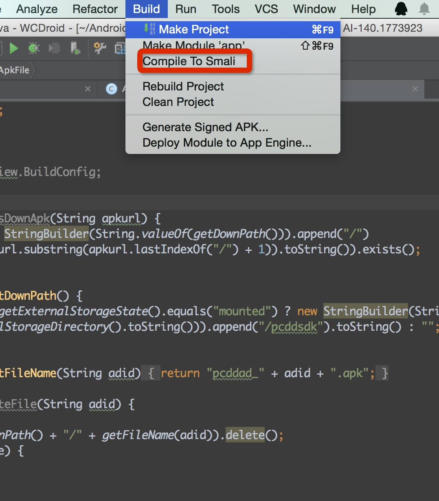
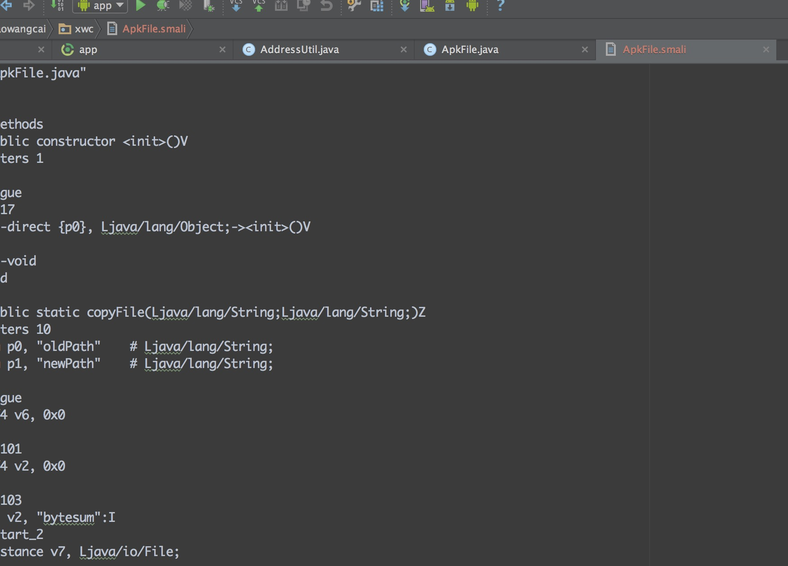

# Java2SmaliStudio
===================

Java Code 2 Smali Plugin for IntelliJ IDEA &amp; Android Studio to easily compile a Java file to smali.

### Usage ###

1. create or open a Java source file with your desired functionality
2. click 'Build' and 'Compile To Smali'
  
3. wait while IDEA's indicating the compilation process
4. the Smali file is opened automatically in your editor
 

Code2Smali is available at [JetBrains Plugin Repository](https://plugins.jetbrains.com/plugin/7712) and can therefore be found in your IDE's plugin manager! Alternatively, you can download the plugin from the release section or download  from [Github Repository](https://github.com/bunnyblue/Java2SmaliStudio/releases).

# Developed By BunnyBlue

# License

 The MIT License (MIT)

Copyright (c) 2015 Bunny Blue

Permission is hereby granted, free of charge, to any person obtaining a copy
of this software and associated documentation files (the "Software"), to deal
in the Software without restriction, including without limitation the rights
to use, copy, modify, merge, publish, distribute, sublicense, and/or sell
copies of the Software, and to permit persons to whom the Software is
furnished to do so, subject to the following conditions:

The above copyright notice and this permission notice shall be included in all
copies or substantial portions of the Software.

THE SOFTWARE IS PROVIDED "AS IS", WITHOUT WARRANTY OF ANY KIND, EXPRESS OR
IMPLIED, INCLUDING BUT NOT LIMITED TO THE WARRANTIES OF MERCHANTABILITY,
FITNESS FOR A PARTICULAR PURPOSE AND NONINFRINGEMENT. IN NO EVENT SHALL THE
AUTHORS OR COPYRIGHT HOLDERS BE LIABLE FOR ANY CLAIM, DAMAGES OR OTHER
LIABILITY, WHETHER IN AN ACTION OF CONTRACT, TORT OR OTHERWISE, ARISING FROM,
OUT OF OR IN CONNECTION WITH THE SOFTWARE OR THE USE OR OTHER DEALINGS IN THE
SOFTWARE.

